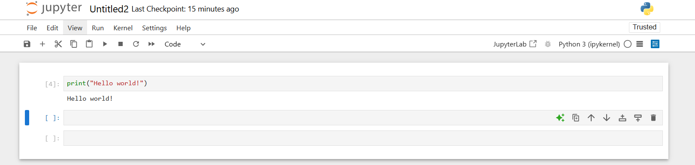

# АНАЛИЗ ДАННЫХ И ИСКУССТВЕННЫЙ ИНТЕЛЛЕКТ [in GameDev] 
Отчет по лабораторной работе #1 выполнил(а):
- Макаридин Матвей Алексеевич 
- НМТ-233719
Отметка о выполнении заданий (заполняется студентом): 

| Задание | Выполнение | Баллы |
| ------ | ------ | ------ |
| Задание 1 | * | ? |
| Задание 2 | * | ? |
| Задание 3 | * | ? |

знак "*" - задание выполнено; знак "#" - задание не выполнено;

Работу проверили:
- к.т.н., доцент Денисов Д.В.
- к.э.н., доцент Панов М.А.
- ст. преп., Фадеев В.О.

[](https://nodesource.com/products/nsolid)

[](https://travis-ci.org/joemccann/dillinger)

Структура отчета

- Данные о работе: название работы, фио, группа, выполненные задания.
- Цель работы.
- Задание 1.
- Код реализации выполнения задания. Визуализация результатов выполнения (если применимо).
- Задание 2.
- Код реализации выполнения задания. Визуализация результатов выполнения (если применимо).
- Задание 3.
- Код реализации выполнения задания. Визуализация результатов выполнения (если применимо).
- Выводы.
- ✨Magic ✨

## Цель работы
Установить необходимое ПО, для создания интеллектуальных моделей на Python и Unity.

## Задание 1
### Написать программу Hello World на Python с запуском в Jupiter Notebook.
Ход работы:
- Скачать Anaconda и запустить "Anaconda-Navigator".
- Запустить инструмент "Jupyter Notebook" и создать файл с именем "HelloWorld".
- Открыть созданный файл с именем "HelloWorld", написав в него команду print() и выполнить.




## Задание 2
### Написать программу Hello World на C# с запуском на Unity.
Ход работы:
- Скачать Unity и авторизоваться.
- Скачать среду разработки для работы с C# (в моем случае Microsoft Visual Studio).
- Создать 3D проект.
- Добавить пустой GameObject.
- Написать скрипт компонента, который будет выводить в консоль "Hello World!".

```C#

using System.Collections;
using System.Collections.Generic;
using UnityEngine;

public class Helloworld : MonoBehaviour 
{
    void Start()
    {
        Debug.Log("Hello world!");
    }
}


```
- Привязать скрипт к объекту и выполнить проект.
  


## Задание 3
### Какую сущность(и) мы бы могли "обучить" ML-Agent-ом для того чтобы создать более качественный игровой опыт?
Адаптивная экономическая сущность
- Увеличивает или снижает цены на ресурсы, в зависимости от покупок игрока
- Предугадывает что в данный момент игроку нужнее и в зависимости от сложности и его действий выдаёт определённый набор ресурсов с определёнными ценами

## Выводы

 Разобрался как работать с Jupyter Notebook и поработал с Unity, а также установил всё необходимое ПО для дальнейшей работы.

| Plugin | README |
| ------ | ------ |
| Dropbox | [plugins/dropbox/README.md][PlDb] |
| GitHub | [plugins/github/README.md][PlGh] |
| Google Drive | [plugins/googledrive/README.md][PlGd] |
| OneDrive | [plugins/onedrive/README.md][PlOd] |
| Medium | [plugins/medium/README.md][PlMe] |
| Google Analytics | [plugins/googleanalytics/README.md][PlGa] |

## Powered by

**BigDigital Team: Denisov | Fadeev | Panov**
